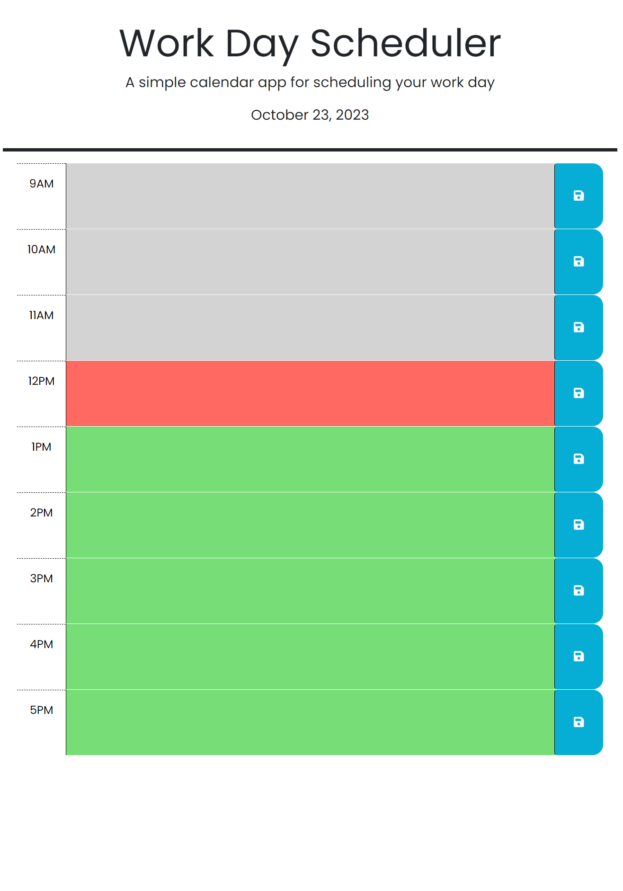
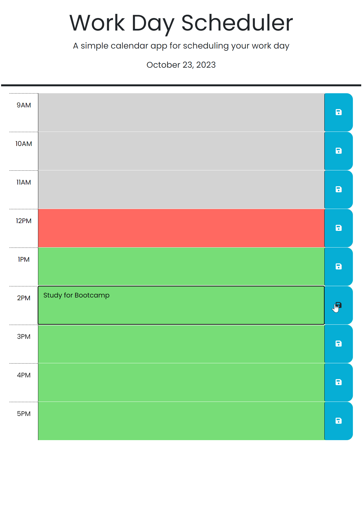
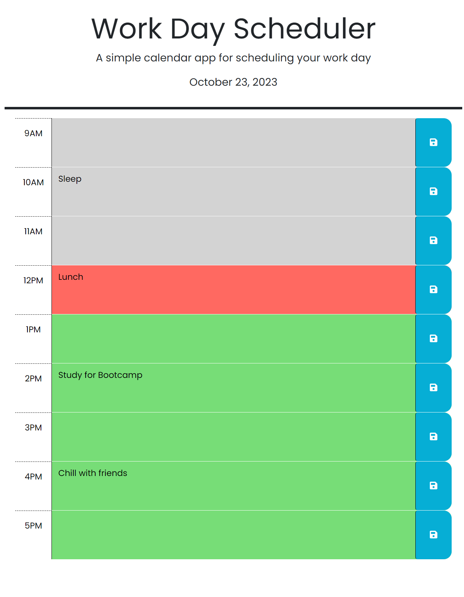
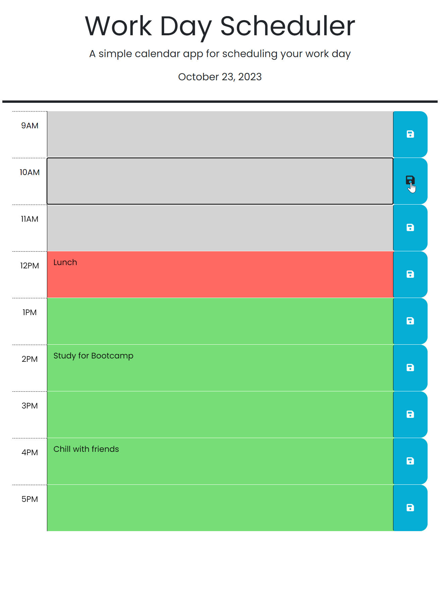

# Personal Calendar

## Description

Interactive work day scheduler that allows user to plan out their day by clicking visual hour elements and typing in tasks or reminders. The tasks persist and are stored in local storage.

My motivation for this project was to provide a usable work day scheduler that would allow planning an prioritization on a daily basis. I used a combination of bootstrap for the CSS, jQuery for the javaScript DOM manipulation, and added a nice google font. It solves the problem of adequately profiting your workday. I learned several new ways to select and navigate DOM elements including the .closest() and .find() methods.

## Usage

This site is up at github pages:

https://spencox.github.io/Personal-Calendar/ 

Location in Github Repository:

https://github.com/Spencox/Personal-Calendar 

Start page is easy to navigate. This is a one page applicaiton for a work day 9AM through 5PM. Notice that the current day for scheduling is at the top. Every 24 hours the date will change and it will clear the tasks in preparation for the next day. The screenshot below shows the current hour highlighted red, past hours in gray, and upcoming hours in green.

Next, the user can click inside of any hourly block and type in a reminder or schedule event. After entering the event a single click on the save disk icon to the right will store the event and will persist through local storage.

The page can be refreshed and the reminder will persist:

If the user made a mistake or needs to reschedule simply click in hourly box element delete task then hit save button. 

## Credits

Coding Boot Camp. (n.d.). Professional Readme Guide. GitHub. https://coding-boot-camp.github.io/full-stack/github/professional-readme-guide

jQuery. (n.d.). .hasClass() Method jQuery API Documentation
https://api.jquery.com/hasClass/#hasClass-className

Original Poster. (2011, September). Find object by id in an array of JavaScript objects. Stack Overflow. https://stackoverflow.com/questions/7364150/find-object-by-id-in-an-array-of-javascript-objects 

